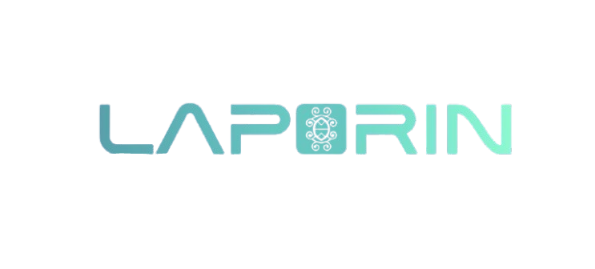

# 🏆 LaporIn - Platform Laporan Warga RT/RW dengan AI & Blockchain

<div align="center">



**Platform civic tech untuk mengelola laporan warga di level RT/RW dengan integrasi AI untuk klasifikasi otomatis dan Blockchain untuk audit trail yang immutable.**

[](https://nextjs.org/)
[](https://react.dev/)
[](https://www.typescriptlang.org/)
[](https://www.postgresql.org/)
[](https://polygon.technology/)

</div>

---

## 📋 Table of Contents

- [Apa Itu LaporIn?](#-apa-itu-laporin)
- [Dampak & Manfaat](#-dampak--manfaat)
- [Fitur Utama](#-fitur-utama)
- [Alur Kerja (Workflow)](#-alur-kerja-workflow)
- [Chatbot AI](#-chatbot-ai)
- [Tech Stack](#️-tech-stack)
- [Dokumentasi](#-dokumentasi)
- [Team & Copyright](#-team--copyright)

---

## 🎯 Apa Itu LaporIn?

**LaporIn** adalah platform civic tech yang memungkinkan warga untuk melaporkan masalah infrastruktur, sosial, dan administrasi di level RT/RW dengan cara yang efisien dan transparan. Platform ini menggunakan **AI (Artificial Intelligence)** untuk auto-processing laporan dan **Blockchain** untuk audit trail yang immutable.

### 🎯 Problem Statement

1. **Inefficiency**: Laporan warga sering tersebar (WhatsApp, telepon, lisan) dan sulit ditrack
2. **Lack of Transparency**: Tidak ada audit trail yang jelas untuk proses penanganan
3. **Manual Processing**: Pengurus RT/RW harus manual klasifikasi dan prioritas
4. **No Analytics**: Tidak ada data untuk perencanaan dan evaluasi

### 💡 Solution

**LaporIn** menyediakan:
- ✅ **Centralized Platform**: Semua laporan dalam satu sistem
- ✅ **AI Auto-Processing**: Klasifikasi otomatis, prioritas, dan ringkasan
- ✅ **Blockchain Audit Trail**: Setiap perubahan status dicatat permanen di blockchain
- ✅ **Analytics Dashboard**: Statistik dan insights untuk pengurus RT/RW
- ✅ **Smart Chatbot**: AI assistant untuk membantu warga membuat laporan via chat

---

## 🌟 Dampak & Manfaat

### Untuk Warga
- ✅ **Kemudahan Pelaporan**: Chat natural language seperti WhatsApp, tidak perlu isi form panjang
- ✅ **Transparansi**: Bisa track status laporan real-time dengan blockchain verification
- ✅ **Akses Mudah**: Tersedia di web dan mobile app (Android)
- ✅ **Keamanan Data**: Face recognition 2FA dengan blockchain audit trail

### Untuk Pengurus RT/RW
- ✅ **Efisiensi**: AI otomatis klasifikasi dan prioritas laporan
- ✅ **Analytics**: Dashboard dengan statistik lengkap untuk perencanaan
- ✅ **Transparansi**: Setiap tindakan tercatat di blockchain (immutable)
- ✅ **Manajemen Terpusat**: Semua laporan dalam satu sistem, mudah di-track

### Untuk Masyarakat
- ✅ **Akuntabilitas**: Setiap laporan dan penanganan tercatat permanen di blockchain
- ✅ **Data-Driven**: Analytics membantu perencanaan pembangunan berbasis data
- ✅ **Partisipasi Warga**: Memudahkan warga untuk berpartisipasi dalam pembangunan lingkungan
- ✅ **Transparansi Publik**: Blockchain memastikan tidak ada manipulasi data

---

## ✨ Fitur Utama

### 👥 Untuk Warga
- ✅ **Registrasi & Login** dengan validasi email
- ✅ **Face Recognition 2FA** untuk keamanan tambahan
  - Biometric blockchain integration (hash tersimpan di blockchain)
  - AES encryption untuk data biometric
  - Privacy-first approach (hanya hash, bukan data asli)
- ✅ **Buat Laporan via Form** atau **via AI Chatbot** (natural language)
- ✅ **GPS Location Picker** dengan validasi RT/RW
- ✅ **Camera Integration** untuk foto laporan
- ✅ **Track Status Laporan** dengan timeline real-time
- ✅ **Blockchain Verification** untuk transparansi
- ✅ **Dashboard Personal** dengan filter & search
- ✅ **Mobile App Native** (Flutter - Android) dengan fitur lengkap

### 👔 Untuk Admin & Pengurus RT/RW
- ✅ **Analytics Dashboard** dengan charts interaktif
  - KPI cards (Total, Selesai, Diproses, Menunggu, Dibatalkan)
  - Tren laporan (Hari/Minggu/Bulan)
  - Pertumbuhan warga
  - Distribusi (Status, Kategori, Urgensi, Gender)
- ✅ **Report Management** dengan table MUI
  - Filter & search
  - Quick actions (Mulai Proses, Selesaikan)
  - Pagination
- ✅ **User Management** (Admin Sistem)
  - List, create, delete users
  - Filter by role
  - Search functionality
- ✅ **RT Queue Panel** untuk antrian laporan
- ✅ **Data Warga** untuk melihat data warga per RT/RW

### 🤖 AI Features
- ✅ **Smart Chatbot dengan NLP (Natural Language Processing)** 🤖
  - **AI-Powered Intent Detection** - Memahami maksud user dari bahasa natural menggunakan AI
  - **Semantic Understanding** - Bisa menangani variasi bahasa, konteks, dan bahasa santai
  - **Entity Extraction** - Otomatis ekstrak problem, location, urgency dari chat conversation
  - **Context-Aware** - Memahami konteks percakapan multi-turn (percakapan berkelanjutan)
  - **Auto-Report Generation** - Buat laporan langsung dari chat conversation tanpa perlu isi form
  - **Hybrid NLP Approach** - Kombinasi AI semantic understanding + keyword fallback untuk akurasi tinggi (~90-95%)
  - **9 Intent Types** - CREATE_REPORT, CHECK_STATUS, ASK_STATS, ASK_CAPABILITY, ASK_HELP, dll
  - **Preview Mode** - User bisa review draft laporan sebelum submit
  - **Role-based Responses** - Respon berbeda untuk warga vs admin
  
- ✅ **AI Fraud Detection** untuk keamanan:
  - Duplicate report detection (semantic similarity + location + time)
  - Spam/fake content detection dengan AI content analysis
  - Data quality validation
  - Anomaly pattern detection
  
- ✅ **Auto-Processing** untuk laporan:
  - Auto-categorization (infrastruktur, sosial, administrasi, bantuan)
  - Auto-urgency detection (high, medium, low)
  - Auto-summarization

### ⛓️ Blockchain Features
- ✅ **Smart Contract** (WargaLapor.sol)
- ✅ **Immutable Audit Trail**
  - Setiap laporan → blockchain
  - Setiap perubahan status → blockchain
  - **Biometric Registration** → blockchain (hash only, privacy-first)
- ✅ **Transaction Verification**
  - Link ke Polygonscan
  - Public verification
  - Meta hash untuk integrity
- ✅ **Biometric Blockchain Integration**
  - Hash biometric tersimpan di blockchain untuk audit trail
  - Data asli tetap di database (encrypted)
  - Privacy-compliant (GDPR-ready)

### 🔒 Security Features
- ✅ **Laporan Sensitif/Rahasia** dengan akses terbatas
  - Hanya Superadmin, Admin RW/RT di wilayah, dan pembuat laporan yang bisa melihat
  - Auto-detection keyword sensitif di chatbot
  - Email notification khusus untuk laporan sensitif
- ✅ **Role-Based Access Control** (RBAC)
- ✅ **JWT Authentication**
- ✅ **Password Hashing** dengan bcrypt
- ✅ **AES Encryption** untuk data sensitif

**📖 Detail lengkap**: [docs/FEATURES.md](./docs/FEATURES.md)

---

## 🔄 Alur Kerja (Workflow)

### Alur Pelaporan Warga

```
1. Warga Login
   ↓
2. Pilih: Buat Laporan via Form ATAU via Chatbot
   ↓
3a. Via Form:
   - Isi form (judul, deskripsi, lokasi, kategori, urgensi)
   - Upload foto (opsional)
   - Submit
   
3b. Via Chatbot:
   - Chat natural language: "ada got mampet di jl digidaw nomer 121"
   - AI extract: problem, location, urgency
   - Preview draft laporan
   - Konfirmasi atau edit
   - Submit
   ↓
4. AI Auto-Processing:
   - Auto-categorization
   - Auto-urgency detection
   - Auto-summarization
   ↓
5. Blockchain Logging:
   - Laporan dicatat ke blockchain
   - Transaction hash tersimpan
   ↓
6. Status: PENDING
   ↓
7. Pengurus/RT/RW Review:
   - Lihat di dashboard
   - Update status: IN_PROGRESS
   ↓
8. Penanganan:
   - RT/RW menangani masalah
   - Update status: RESOLVED
   ↓
9. Notifikasi ke Warga:
   - Email notification
   - Status update di dashboard
   - Blockchain verification link
```

### Alur Status Laporan

```
PENDING → IN_PROGRESS → RESOLVED
   ↓           ↓
CANCELLED  CANCELLED
```

**Penjelasan:**
- `pending`: Laporan baru dibuat, menunggu review
- `in_progress`: Sedang diproses (oleh pengurus atau RT/RW)
- `resolved`: Selesai ditangani
- `cancelled`: Dibatalkan (bisa dari status manapun)

### Alur Chatbot AI

```
1. User kirim pesan: "ada got mampet di jl digidaw nomer 121"
   ↓
2. AI NLP Processing:
   - Intent Detection: CREATE_REPORT
   - Entity Extraction: problem="got mampet", location="jl digidaw nomer 121"
   - Context Analysis: memahami konteks percakapan sebelumnya
   ↓
3. Jika informasi LENGKAP:
   - Generate draft laporan
   - Auto-fill: title, description, location, category, urgency
   - Ambil GPS location otomatis dari device
   ↓
4. Preview & Konfirmasi:
   - Tampilkan draft laporan
   - Tombol: Edit, Batal, Kirim
   ↓
5. User konfirmasi:
   - Klik "Kirim" → Laporan dibuat
   - Klik "Edit" → Buka form untuk edit manual
   - Klik "Batal" → Draft dibatalkan
   ↓
6. Laporan dibuat:
   - AI auto-processing
   - Blockchain logging
   - Status: PENDING
   - Notifikasi ke admin
```

**📖 Detail lengkap**: [docs/WORKFLOW.md](./docs/WORKFLOW.md)

---

## 🤖 Chatbot AI

### Cara Kerja Chatbot

Chatbot LaporIn menggunakan **NLP (Natural Language Processing)** yang canggih dengan kombinasi:
1. **Groq AI** untuk semantic understanding (pemahaman makna)
2. **Keyword-based** sebagai fallback untuk keamanan

### Fitur Chatbot

#### 1. **AI-Powered Intent Detection** ✅
- Menggunakan Groq AI (Llama 3.1) untuk semantic understanding
- Memahami konteks percakapan
- Bisa menangani variasi bahasa natural

**Contoh:**
- User: "tolong ada got mampet nih woi di jl digidaw nomr 121"
- AI NLP: Deteksi intent `CREATE_REPORT` dengan confidence tinggi
- Extract entities: problem="got mampet", location="jl digidaw nomr 121"

#### 2. **Hybrid Approach (AI + Keyword)** ✅
**Strategi:**
1. **Coba AI NLP dulu** untuk semantic understanding
2. **Jika AI confidence > 0.7** → gunakan hasil AI
3. **Jika AI tidak yakin atau gagal** → fallback ke keyword-based
4. **Jika keduanya setuju** → tingkatkan confidence

**Keuntungan:**
- Lebih akurat untuk bahasa natural
- Tetap aman dengan keyword fallback
- Confidence yang lebih tinggi jika keduanya setuju

#### 3. **Entity Extraction** ✅
AI NLP juga mengekstrak entities dari pesan:
- **Problem**: Masalah yang disebutkan (lampu mati, jalan rusak, dll)
- **Location**: Lokasi yang disebutkan (jl sigma nomor 69, blok C, dll)
- **Urgency**: Urgensi yang bisa diinfer (high/medium/low)

#### 4. **Context-Aware Conversation** ✅
Memahami konteks percakapan multi-turn:

```
Turn 1:
User: "ada masalah nih"
Bot: "Ada masalah apa? Tolong jelaskan detailnya"

Turn 2:
User: "lampu mati"
Bot: "Baik, di mana lokasi lampu yang mati?"

Turn 3:
User: "di blok C"
Bot: "Baik, draft laporan sudah dibuat. Klik tombol di bawah untuk mengirim."
```

#### 5. **Auto-Report Generation** ✅
- Generate report dari chat natural language
- Auto-extract: title, description, location, category, urgency
- Preview mode (review sebelum submit)
- Direct creation dengan konfirmasi

#### 6. **9 Intent Types yang Didukung**
- `CREATE_REPORT` - User ingin membuat laporan
- `CHECK_STATUS` - User cek status laporan
- `ASK_STATS` - User tanya statistik
- `ASK_CAPABILITY` - User tanya kemampuan bot
- `ASK_HELP` - User minta bantuan
- `NEGATION` - User bilang tidak/tidak mau
- `PREVIEW_REPORT` - User minta preview
- `ASK_FAQ` - User tanya FAQ
- `GENERAL` - Percakapan umum

#### 7. **Role-based Responses** ✅
- Respon berbeda untuk warga vs admin
- Warga: bisa membuat laporan
- Admin: fokus pada manajemen dan statistik laporan

#### 8. **Sensitive Report Detection** ✅
- Auto-detection keyword sensitif dalam chat
- Otomatis mark laporan sebagai sensitif
- Notifikasi ke user jika laporan mereka sensitif

**📖 Detail lengkap**: [docs/CHATBOT.md](./docs/CHATBOT.md)

---

## 🛠️ Tech Stack

### Frontend Web
- **Framework**: Next.js 16 (App Router) dengan React 19
- **Language**: TypeScript 5.x
- **Styling**: Tailwind CSS 4.x, Material-UI 7.x
- **State Management**: Zustand 4.x
- **Charts**: Chart.js 4.x, react-chartjs-2
- **Icons**: Lucide React
- **HTTP Client**: Axios
- **Real-time**: Socket.IO Client

### Frontend Mobile
- **Framework**: Flutter 3.x (Dart)
- **State Management**: Riverpod 2.x
- **UI**: Material Design 3, Google Fonts (Inter)
- **Face Recognition**: Google ML Kit
- **Location**: Geolocator, Permission Handler
- **HTTP Client**: Dio
- **Local Storage**: SharedPreferences, Hive
- **Real-time**: Socket.IO Client (ready)

### Backend
- **Runtime**: Node.js 18+
- **Framework**: Express.js 4.x
- **Database**: PostgreSQL 12+
- **ORM**: Prisma
- **Authentication**: JWT (jsonwebtoken)
- **Security**: bcryptjs, crypto-js (AES encryption)
- **Real-time**: Socket.IO
- **Location**: Reverse Geocoding, Location Validation

### AI Services
- **AI Processing**: Auto-categorization, urgency detection, summarization
- **NLP (Natural Language Processing)**: 
  - **AI-Powered Intent Detection** - Semantic understanding dengan AI
  - **Hybrid Approach** - Kombinasi AI + keyword-based untuk akurasi tinggi
  - **Entity Extraction** - Extract problem, location, urgency dari teks natural
  - **PII Redaction** - Redaksi data sensitif
  - **Context-Aware** - Memahami konteks percakapan sebelumnya
- **Smart Chatbot**: Natural language processing dengan intent detection
- **AI Fraud Detection**: Duplicate detection, spam filtering, anomaly detection
- **AI Provider**: Groq API (Llama 3.1-8b-instant)

### Blockchain
- **Network**: Polygon Mumbai Testnet
- **Smart Contract**: Solidity 0.8.19
- **Framework**: Hardhat
- **Library**: Ethers.js v6

**📖 Detail lengkap**: [docs/TECH_STACK.md](./docs/TECH_STACK.md)

---

## 📖 Dokumentasi

Dokumentasi kini terstruktur per modul. Mulai dari sini:

- 📚 [docs/README.md](./docs/README.md) – Index dokumentasi & panduan proyek
- ✨ [docs/FEATURES.md](./docs/FEATURES.md) – Daftar lengkap semua fitur
- 🔄 [docs/WORKFLOW.md](./docs/WORKFLOW.md) – Alur kerja dan workflow sistem
- 🤖 [docs/CHATBOT.md](./docs/CHATBOT.md) – Dokumentasi chatbot AI
- 🔐 [docs/BIOMETRIC_BLOCKCHAIN.md](./docs/BIOMETRIC_BLOCKCHAIN.md) – Dokumentasi biometric blockchain integration
- 🛠️ [docs/TECH_STACK.md](./docs/TECH_STACK.md) – Detail teknologi yang digunakan
- 📡 [docs/API_DOCUMENTATION.md](./docs/API_DOCUMENTATION.md) – API reference lengkap

Dokumen historis/duplikat sudah dipindahkan ke [`docs/archive/`](./docs/archive) supaya repo utama lebih rapi.

---

## 👥 Team & Copyright

<div align="center">

### **Weladalah Team - IT Fair XIV Hackathon 2025**

**Tim Pengembang:**
- **Abhi** - Full Stack Developer
- **Ghiffari** - Blockchain & AI Developer
- **Dyandra** - Frontend Developer and UI/UX Design
- **Faris** - Problem Solver & Solution

---

### 📄 Copyright

**© 2025 Weladalah Team. All Rights Reserved.**

Platform LaporIn dikembangkan oleh **Weladalah Team**.

**Hak Cipta:**
- Semua kode, desain, dan dokumentasi dalam repository ini adalah hak cipta **Weladalah Team**.
- Penggunaan untuk tujuan pendidikan dan non-komersial diperbolehkan dengan atribusi.
- Untuk penggunaan komersial, silakan hubungi tim pengembang.

---

**Made with ❤️ by Weladalah Team**

</div>
